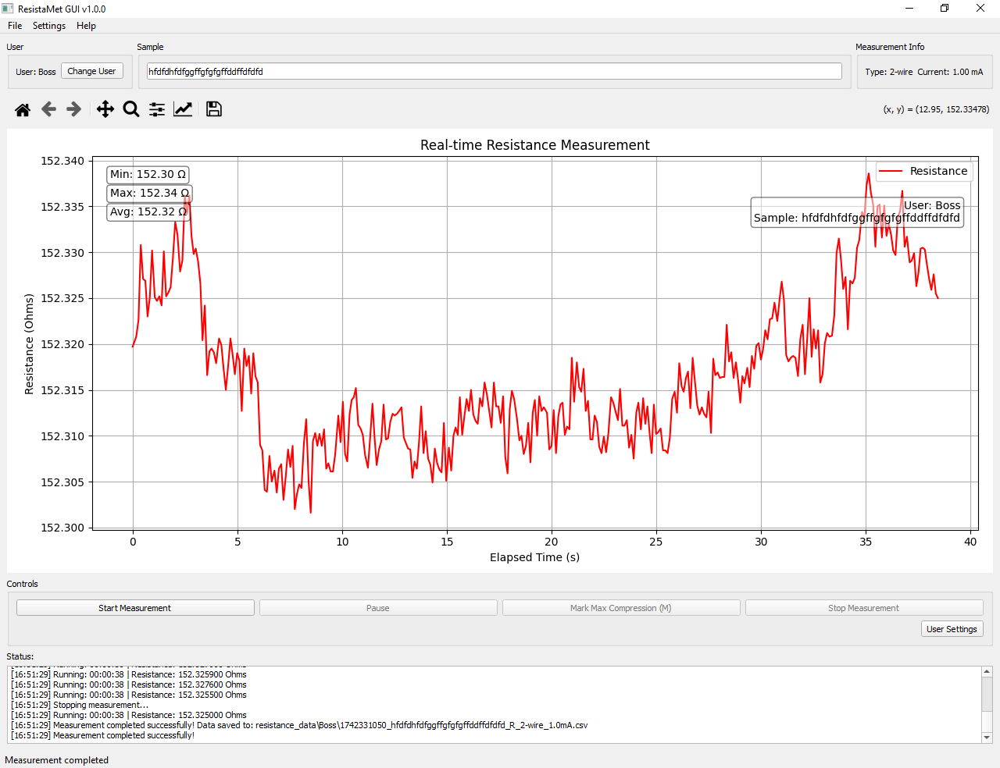

# ResistaMet GUI

A comprehensive graphical interface for electrical measurements using Keithley sourcemeters with advanced four-point probe capabilities.

**Version:** 1.2.0
**Author:** Brenden Ferland
**Based on:** ResistaMet v0.9.2



## Overview

ResistaMet GUI is a powerful PyQt5-based application for electrical characterization using Keithley instruments (2400/2450 series). Originally designed for resistance measurements, it has evolved into a full-featured measurement suite with support for multiple measurement modes, advanced data analysis, and a modular architecture.

## Key Features

### 🔬 Measurement Modes

#### 1. **Resistance Measurement**
- 2-wire and 4-wire measurement support
- Configurable test current (up to 3A)
- Voltage compliance (up to 200V)
- Auto-ranging capability
- Real-time resistance monitoring

#### 2. **Voltage Source Mode**
- Programmable DC voltage output (-200V to +200V)
- Current compliance monitoring (up to 3A)
- Time-based measurements with configurable duration
- Negative bias support for advanced characterization
- Plot current, voltage, or calculated resistance

#### 3. **Current Source Mode**
- Programmable DC current output (-3A to +3A)
- Voltage compliance monitoring (up to 200V)
- Time-based measurements
- Bidirectional current sourcing
- Plot voltage, current, or calculated resistance

#### 4. **Four-Point Probe (4PP) Mode** ⭐ _New in v1.2.0_
- Full van der Pauw and linear 4-point probe support
- Real-time sheet resistance (Rs), resistivity (ρ), and conductivity (σ) calculations
- Configurable probe geometry (spacing in cm)
- Thin film and bulk material models
- Advanced options:
  - Custom K correction factor (default 4.532)
  - Alpha multiplier for thin films
  - Thickness input (µm) for resistivity calculations
  - Sample averaging (continuous or fixed count)
- Live statistics: mean, standard deviation, RSD
- Measurement table with individual data points
- Summary export with averaged results
- Remote sensing automatically enabled

### 📊 Data Visualization & Analysis

- **Real-time Plotting:**
  - Live updating matplotlib graphs
  - Interactive controls (zoom, pan, save)
  - Configurable plot variables per mode
  - Dynamic axis labels
  - Optional plot hiding for data-only workflows

- **Results Viewer:** ⭐ _New in v1.2.0_
  - Built-in CSV viewer for analyzing past measurements
  - Plot any column from historical data
  - Integrated into main window

- **Statistics Display:**
  - Min/max/average for standard modes
  - Mean/std/RSD for 4PP measurements
  - Live updates during measurement

### 🎨 Modern UI Features ⭐ _Enhanced in v1.2.0_

- **Resizable Panels:**
  - QSplitter-based layout for flexible workspace
  - Adjustable Parameters, Plot, Controls, and Status Log sections
  - Persistent splitter positions

- **View Menu Toggles:**
  - Hide/show Parameters panel
  - Hide/show Controls panel
  - Hide/show Status Log
  - Maximize plot area when needed

- **4PP Optimized Layout:**
  - Horizontal split: Parameters left, Summary/Table right
  - Efficient use of screen real estate
  - Windows-compatible rendering

### 💾 Data Management

- **Automatic Data Export:**
  - CSV format with timestamps
  - UTF-8 encoding with BOM (Excel-compatible special characters: Ω, µ, ρ)
  - Separate data and summary exports for 4PP
  - Configurable auto-save intervals

- **Profiles System:** ⭐ _New in v1.2.0_
  - Save measurement configurations per mode
  - Load profiles for repeatable experiments
  - JSON format for easy sharing
  - Per-mode profile management

- **Multi-user Support:**
  - Per-user configuration settings
  - User-specific data storage directories
  - Quick user switching

### 🔧 Advanced Features

- **Pause/Resume:** Temporarily halt measurements without losing data
- **Event Marking:** Press 'M' to mark important events during measurement
- **Compliance Stop:** Automatic measurement termination on compliance
- **Quick GPIB Selection:** Popup selector on connection errors
- **Settings Persistence:** All configurations saved between sessions

## Installation

### Requirements

- Python 3.6 or higher
- PyQt5
- PyVISA
- Matplotlib
- NumPy

### Installation Steps

1. **Clone the repository:**

   ```bash
   git clone https://github.com/PEEKPerformer/ResistaMet-GUI.git
   cd ResistaMet-GUI
   ```

2. **Install required Python packages:**

   ```bash
   pip install pyqt5 pyvisa pyvisa-py numpy matplotlib
   ```

3. **Hardware-specific dependencies:**

   Depending on your GPIB interface:

   - **National Instruments GPIB:** Install NI-VISA
   - **Prologix GPIB-USB:** Use pyvisa-py (included above)
   - **Other adapters:** Install appropriate drivers

4. **Run the application:**

   ```bash
   python resistamet-gui.py
   ```

## Quick Start Guide

### First Time Setup

1. **Launch the application** and select or create a user profile
2. **Connect your instrument:**
   - File → Connect to Device
   - Select the correct GPIB address (default: GPIB0::24::INSTR)
3. **Choose a measurement mode** from the tabs

### Making a Measurement

#### Resistance Measurement
1. Select "Resistance" tab
2. Configure:
   - Test Current (e.g., 1 mA = 0.001 A)
   - Voltage Compliance (e.g., 10 V)
   - Measurement Type (2-wire or 4-wire)
3. Enter a sample name
4. Click "Start Measurement"

#### Four-Point Probe Measurement
1. Select "Four Point Probe" tab
2. Configure probe geometry:
   - Probe Spacing (e.g., 0.1 cm)
   - Thickness (optional, in µm)
   - Model (infinite/semi-infinite/thin film)
3. Set measurement parameters:
   - Source Current (typical: 1-100 µA)
   - Voltage Compliance
   - Samples (0 = continuous, or set count)
4. Click "Start Measurement"
5. View live Rs, ρ, σ in the summary panel
6. Export summary statistics when complete

### Using Profiles

- **Save a profile:** File → Profiles → Save Current Profile
- **Load a profile:** File → Profiles → Load Profile
- Profiles store all mode-specific settings for easy reuse

### Keyboard Shortcuts

- **M:** Mark event during measurement
- **Ctrl+S:** Save current plot
- Standard shortcuts for zoom, pan in matplotlib toolbar

## Instrument Specifications

ResistaMet GUI supports the full capabilities of modern Keithley sourcemeters:

| Parameter | Range | Notes |
|-----------|-------|-------|
| Voltage Output | -200V to +200V | Keithley 2450/2400 dependent |
| Current Output | -3A to +3A | Full instrument range |
| Voltage Compliance | 0.1V to 200V | Protection limit |
| Current Compliance | 1e-7A to 3A | Protection limit |
| Measurement Modes | 2-wire, 4-wire | Remote sensing for 4PP |

## Architecture ⭐ _New in v1.2.0_

The codebase has been modularized into a clean package structure:

```
ResistaMet-GUI/
├── resistamet-gui.py          # Entry point
├── resistamet_gui/            # Main package
│   ├── __init__.py
│   ├── constants.py           # Global constants
│   ├── config.py              # Configuration management
│   ├── buffers.py             # Data buffer classes
│   ├── workers.py             # Measurement worker threads
│   ├── instrument.py          # Keithley VISA wrapper
│   └── ui/                    # UI modules
│       ├── __init__.py
│       ├── main_window.py     # Main application window
│       ├── dialogs.py         # Settings and dialogs
│       └── canvas.py          # Matplotlib integration
├── README.md
└── requirements.txt
```

This modular design improves:
- Code maintainability
- Testability
- Future extensibility
- Separation of concerns

## Configuration Options

### Measurement Settings

- **Test Current / Source Current:** Applied current (A)
- **Voltage Compliance / Source Voltage:** Voltage limit or output (V)
- **Sampling Rate:** Measurements per second (Hz)
- **NPLC:** Power line cycle integration (0.01 - 10)
- **Settling Time:** Pre-measurement delay (seconds)
- **Duration:** Time-based measurement length (hours)
- **Stop on Compliance:** Auto-stop when limits reached

### Display Settings

- **Plot Update Interval:** Refresh rate (ms)
- **Plot Color:** Line color selection
- **Buffer Size:** Data points in memory

### File Settings

- **Auto-save Interval:** Automatic save frequency (seconds)
- **Data Directory:** Base folder for CSV exports

## Troubleshooting

### Connection Issues

1. **GPIB not found:**
   - Verify GPIB interface is connected
   - Check drivers (NI-VISA or pyvisa-py)
   - Try: `python -m visa info`

2. **Wrong GPIB address:**
   - Use File → Connect to Device
   - Try auto-detection or manual entry
   - Common addresses: 22, 23, 24

3. **Timeout errors:**
   - Increase timeout in settings
   - Check instrument is not in local mode
   - Verify cable connections

### Measurement Issues

1. **Compliance errors:**
   - Increase compliance limit
   - Reduce source level
   - Check sample connections

2. **Noisy data:**
   - Increase NPLC (slower but more accurate)
   - Use 4-wire measurement
   - Enable auto-range
   - Check for ground loops

3. **4PP calculations seem wrong:**
   - Verify probe spacing is correct (cm)
   - Check thickness input (µm, not cm)
   - Ensure correct model selected
   - Verify K factor (default 4.532 for linear array)

### UI Issues

1. **Windows: Panels too small:**
   - v1.2.0 includes fixes for zero-size rendering
   - Drag splitter handles to resize
   - Use View menu to hide/show sections

2. **Plot not updating:**
   - Check "Enable Plot" is on
   - Verify plot isn't hidden (View menu)
   - Reduce update interval if CPU is slow

## Data File Formats

### Standard Measurement CSV
```
Timestamp,Elapsed Time (s),Resistance (Ω),Voltage (V),Current (A),Event
2025-11-19 10:30:00,0.0,1234.56,1.23,0.001,
2025-11-19 10:30:01,1.0,1234.58,1.23,0.001,
2025-11-19 10:30:05,5.0,1235.12,1.23,0.001,Max Compression
```

### Four-Point Probe CSV
```
Timestamp,Elapsed Time (s),V/I (Ω),Rs (Ω/sq),ρ (Ω·cm),σ (S/cm)
2025-11-19 10:30:00,0.0,100.5,45.2,1.2e-3,833.3
```

### Four-Point Probe Summary CSV
```
Parameter,Mean,Std Dev,RSD (%)
Sheet Resistance (Ω/sq),45.23,0.15,0.33
Resistivity (Ω·cm),1.23e-3,4.2e-6,0.34
Conductivity (S/cm),812.5,2.8,0.34
```

## Version History

### v1.2.0 (2025-11-19)
- Added Four-Point Probe measurement mode
- Modularized codebase architecture
- Instrument abstraction and profiles system
- Results viewer for CSV analysis
- Enhanced UI with splitters and view toggles
- Increased instrument limits to 200V/3A
- Windows compatibility improvements
- Numerous bug fixes

### v1.1.0 (2025-03-25)
- Added voltage and current source modes
- Enhanced data buffering
- Improved CSV export

### v1.0.0
- Initial release
- Basic resistance measurement
- 2-wire and 4-wire support

## Contributing

Contributions are welcome! Please feel free to submit issues or pull requests.

## License

ResistaMet GUI is provided under the MIT License with Academic Citation Clause.

## Citation

If you use ResistaMet GUI in your research, please cite:

```
Ferland, B. (2025). ResistaMet GUI: A Comprehensive Electrical Measurement Suite
for Keithley Sourcemeters (Version 1.2.0) [Software].
https://github.com/PEEKPerformer/ResistaMet-GUI
```

## Support

For questions, bug reports, or feature requests:
- Open an issue on GitHub
- Contact: brendenferland@gmail.com

---

**Happy measuring!** 🔬⚡
