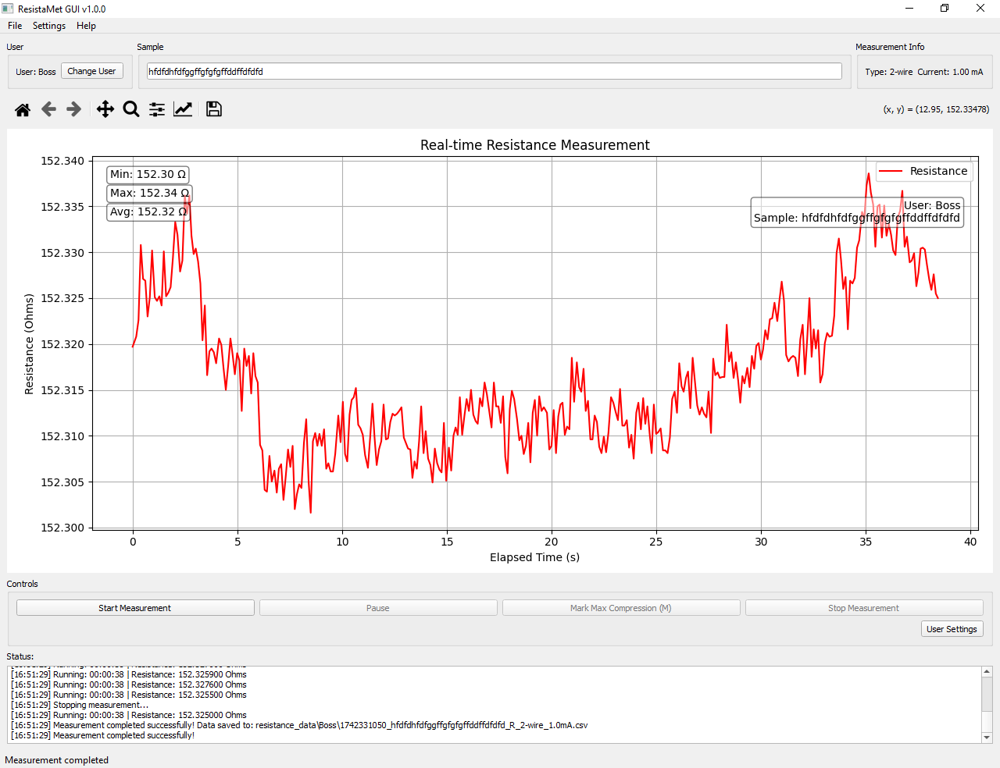

# ResistaMet GUI

Open-source graphical interface for electrical characterization using Keithley 2400/2450 sourcemeters, with advanced four-point probe analysis.

**Version:** 1.3.0
**Author:** Brenden Ferland



## Overview

ResistaMet GUI is a PyQt5-based desktop application for controlling Keithley sourcemeters and performing electrical measurements. It supports four measurement modes, real-time data visualization, multi-spot four-point probe analysis with delta mode, and dual-format data export.

## Features

### Measurement Modes

| Mode | Sources | Measures | Use Case |
|------|---------|----------|----------|
| **Resistance** | Current (up to 3A) | Resistance | 2-wire/4-wire resistance measurement |
| **Voltage Source** | Voltage (-200 to +200V) | Current | Bias stress, I-V characterization |
| **Current Source** | Current (-3 to +3A) | Voltage | Material characterization |
| **Four-Point Probe** | Current | Voltage | Sheet resistance, resistivity, conductivity |

### Four-Point Probe

- Sheet resistance (Rs), resistivity, and conductivity calculated in real time
- **Multi-spot tracking** -- save measurements at multiple probe positions, compare uniformity
- **Live histogram** of Rs distribution (replaces flat-line plot)
- **Current reversal (delta mode)** -- alternates +I/-I to cancel thermoelectric EMF
- Models: thin film, semi-infinite, finite thin, with configurable K factor and alpha correction
- Inter-spot uniformity statistics in export

### Engineering Notation Input

Type natural lab notation instead of raw decimals:
- `1mA` instead of `0.001000 A`
- `100uA` or `100uA` instead of `0.000100 A`
- `10mV` instead of `0.010 V`

The live readout displays in engineering notation too: `V: 2.830 mV  I: 1.000 mA  R: 2.830 Ohm`

### Data Export

- **Dual format** -- JSON (with full metadata) + CSV (Excel-friendly) written simultaneously
- **Crash recovery** -- periodic checkpoints saved as `.json.tmp`, recoverable after power loss
- **4PP summary export** -- per-spot breakdown with inter-spot uniformity RSD
- Configurable auto-save interval

### Instrument Safety

- Compliance monitoring via Keithley STAT word bit 3 + threshold fallback
- Non-blocking compliance warnings (status bar flash, no modal popup spam)
- "Test Connection" button on every tab for pre-flight verification
- Configurable stop-on-compliance
- System sleep prevention during long measurements

### UI

- Live numeric readout (large font) on all tabs
- Real-time matplotlib plots with interactive toolbar
- Resizable panels via splitters
- Tooltips on every setting explaining what it does and typical values
- Scroll-wheel protection on all spinboxes
- Tab switching allowed during measurement (read-only)
- "Run until stopped" checkbox on timed modes
- Custom event markers with text labels (press M)
- Multi-user profiles with per-user settings

## Installation

### Requirements

- Python 3.6+
- PyQt5
- PyVISA + a VISA backend (NI-VISA or pyvisa-py)
- Matplotlib
- NumPy

### Setup

```bash
git clone https://github.com/PEEKPerformer/ResistaMet-GUI.git
cd ResistaMet-GUI
pip install -r requirements.txt
python resistamet-gui.py
```

For NI GPIB adapters, install [NI-VISA](https://www.ni.com/en/support/downloads/drivers/download.ni-visa.html). For Prologix USB adapters, `pyvisa-py` (included in requirements) works directly.

## Quick Start

1. Launch and create a user profile
2. Click **Test Connection** to verify instrument communication
3. Enter a sample name
4. Set source level and compliance (type `1mA`, `5V`, etc.)
5. Click **Start**

### Four-Point Probe Workflow

1. Set source current, probe spacing, and thickness
2. Start measurement -- readings appear in table with live histogram
3. Click **Save Spot** to archive current position's stats
4. Move probe to next position, repeat
5. After all spots: histogram shows bar chart of Rs uniformity
6. Click **Export Summary** for full report

### Delta Mode (Thermoelectric Cancellation)

1. In the 4PP tab, expand **Advanced**
2. Check **Current Reversal (Delta Mode)**
3. Set settling time (default 0.1s between polarity flips)
4. Each reading now alternates +I/-I, reporting V_delta = (V+ - V-) / 2

## Project Structure

```
ResistaMet-GUI/
├── resistamet-gui.py              # Entry point
├── resistamet_gui/
│   ├── constants.py               # Version, defaults
│   ├── config.py                  # User profiles, JSON persistence
│   ├── buffers.py                 # Circular buffer with statistics
│   ├── calculations.py            # 4PP formulas (pure functions)
│   ├── instrument.py              # Keithley VISA wrapper
│   ├── workers.py                 # Measurement thread (QThread)
│   ├── data_export.py             # Dual JSON+CSV export with checkpoints
│   ├── system_utils.py            # Sleep prevention, platform detection
│   ├── logging_config.py          # Python logging setup
│   └── ui/
│       ├── main_window.py         # Main application window
│       ├── dialogs.py             # Settings dialog
│       ├── canvas.py              # Matplotlib + histogram canvas
│       └── widgets.py             # EngineeringSpinBox, NoScrollSpinBox
├── tests/
│   ├── test_buffers.py
│   ├── test_calculations.py
│   ├── test_config.py
│   ├── test_data_export.py
│   ├── test_system_utils.py
│   ├── test_gui_smoke.py          # Qt widget lifecycle tests
│   └── test_widgets.py            # Engineering notation parsing tests
└── requirements.txt
```

## Testing

```bash
# Run all tests (142 total)
QT_QPA_PLATFORM=offscreen pytest tests/ -v

# Unit tests only (no Qt dependency)
pytest tests/ -v --ignore=tests/test_gui_smoke.py
```

## Instrument Compatibility

Tested with:
- **Keithley 2420** (3A model, firmware C30) via GPIB
- Should work with any Keithley 2400/2450 series via GPIB or USB

## Version History

### v1.3.0 (2026-04-01)
- Fixed 5 critical SCPI bugs found via live Keithley 2420 hardware testing
- Engineering notation input for current/voltage fields
- Live numeric readout on all tabs
- 4PP histogram, multi-spot tracking, current reversal (delta mode)
- Dual-format data export (JSON + CSV) with crash recovery
- 11 UX improvements (non-blocking compliance, tab switching, tooltips, etc.)
- GUI smoke test suite (142 total tests)
- System sleep prevention, instrument health monitoring

### v1.2.0 (2025-11-19)
- Four-Point Probe measurement mode
- Modularized codebase architecture
- Profiles system, results viewer
- Enhanced UI with splitters and view toggles

### v1.1.0 (2025-03-25)
- Voltage and current source modes
- Enhanced data buffering, improved CSV export

### v1.0.0
- Initial release -- basic resistance measurement

## Citation

If you use ResistaMet GUI in your research, please cite:

```
Ferland, B. (2026). ResistaMet GUI: An Open-Source Electrical Measurement Suite
for Keithley Sourcemeters (Version 1.3.0) [Software].
https://github.com/PEEKPerformer/ResistaMet-GUI
```

## Contributing

Contributions welcome -- open an issue or submit a pull request.

## License

MIT License with Academic Citation Clause.
