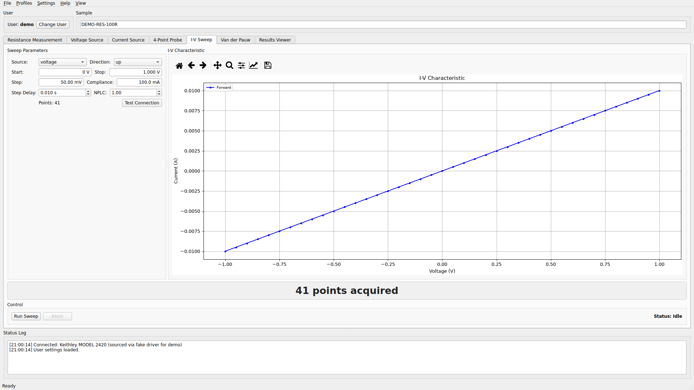
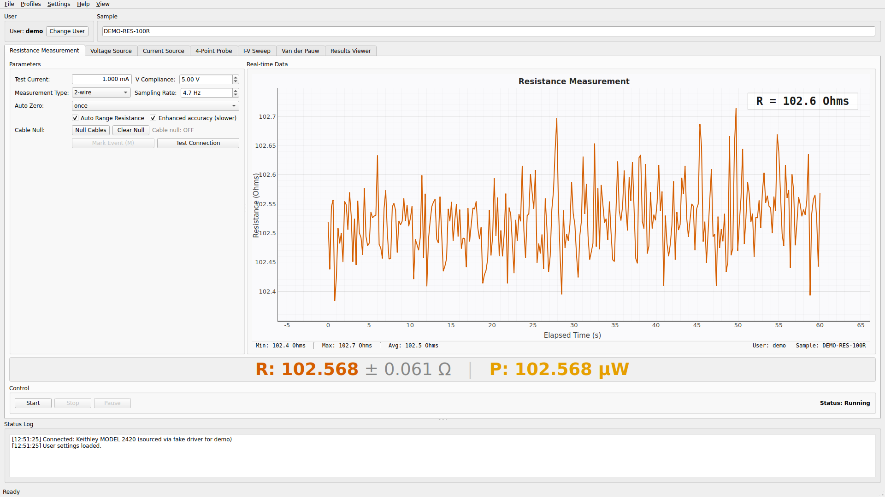
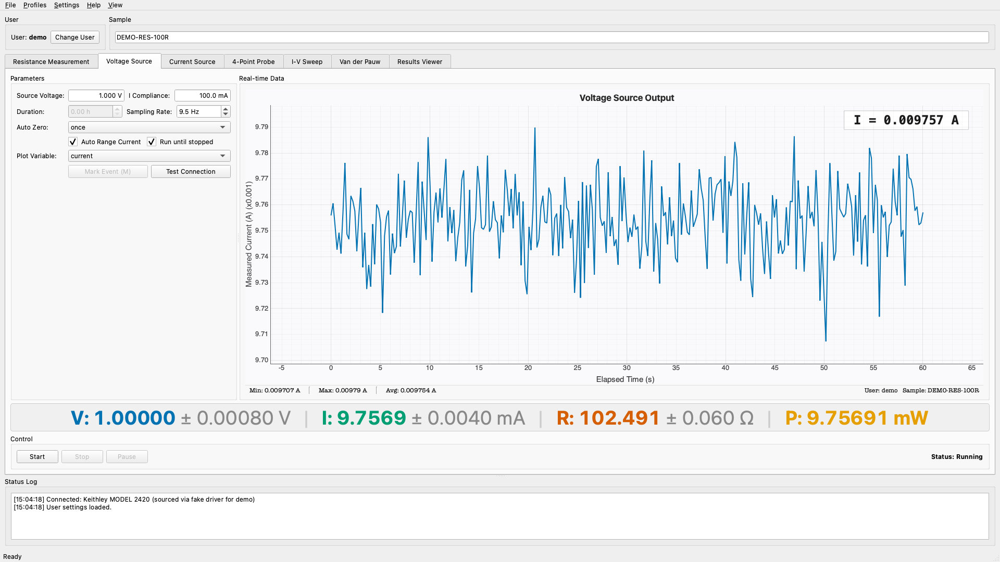
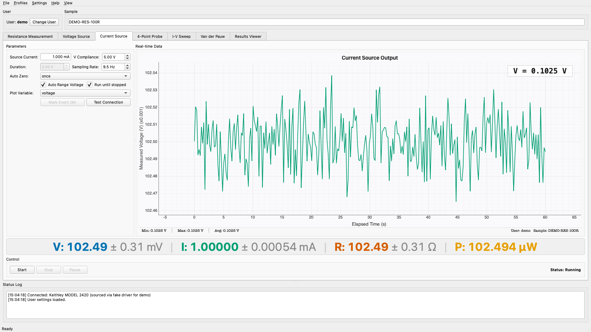
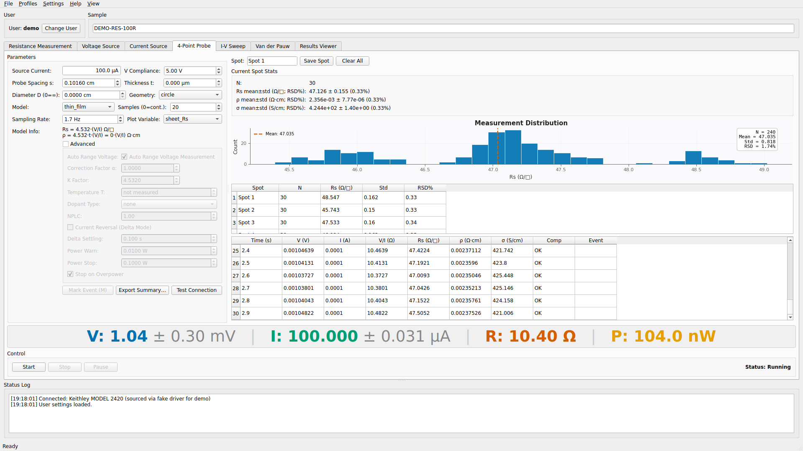

# ResistaMet GUI

[](https://doi.org/10.5281/zenodo.19919751)
[](https://opensource.org/licenses/MIT)
[](https://bfer.land/ResistaMet-GUI/)

Open-source graphical interface for electrical characterization with Keithley 2400-family sourcemeters, with ASTM F84-aligned four-point-probe and ASTM F76 van der Pauw analysis built in.

**Version:** 1.12.0
**Author:** Brenden Ferland



<details>
<summary>More tabs (click to expand)</summary>

| Tab | Screenshot |
|-----|-----------|
| Resistance Measurement |  |
| Voltage Source |  |
| Current Source |  |
| 4-Point Probe |  |
| I-V Sweep |  |

Generated reproducibly via `python tools/generate_screenshots.py` — runs headless under Qt's offscreen platform, no instrument required.

</details>

## Try it now (no instrument required)

```bash
git clone https://github.com/PEEKPerformer/ResistaMet-GUI.git
cd ResistaMet-GUI
pip install -e .
resistamet-gui --simulate
```

This launches the full GUI against an in-package Keithley 2400-family simulator. Every measurement mode works end-to-end with no NI-VISA, no pyvisa-py, and no GPIB hardware. The simulator is byte-validated against captured hardware traces — see [`docs/sim_fidelity.md`](docs/sim_fidelity.md).

Optional: `--sim-resistance 1000` (1 kΩ DUT) or `--sim-model 2410` (advertise a different Keithley model).

If you don't have Python, the latest GitHub release attaches a standalone Windows `.exe` — see [Installation → Windows](https://bfer.land/ResistaMet-GUI/installation/#windows--no-python-required).

## What it does

| Mode | Sources | Measures | Typical use |
|------|---------|----------|-------------|
| **Resistance** | Current | Resistance | 2- or 4-wire resistance, long-duration logging |
| **Voltage Source** | Voltage | Current | Bias stress, chronoamperometry, electrochemistry |
| **Current Source** | Current | Voltage | Material characterization |
| **Four-Point Probe** | Current | Voltage | Sheet resistance + resistivity (ASTM F84) |
| **I-V Sweep** | Voltage *or* Current | Current *or* Voltage | Diode / device curves, hysteresis |
| **Van der Pauw** | Current | Voltage | Sheet resistance on arbitrary-shape samples (ASTM F76) |

Source/measure envelopes vary by model (2400 / 2401 / 2410 / 2420 / 2425 / 2430 / 2440 / 2450) — see the [per-model table](https://bfer.land/ResistaMet-GUI/installation/#instrument-compatibility) in the docs. Per-reading instrument uncertainty from the Keithley datasheet propagates through every derived quantity (sheet resistance, resistivity, conductivity).

## Statement of need

The Keithley 2400 family is standard equipment in materials, sensor, and device-physics labs, but no open application covers the combined workflow of long-duration fixed-bias logging, four-point-probe surveys, van der Pauw, I-V sweeps, and 2-/4-wire resistance on the same instrument. ResistaMet GUI fills that gap for researchers who own a Keithley sourcemeter, don't write instrument-control code, and need every mode of that bench workflow in one point-and-click application.

## Installation

```bash
git clone https://github.com/PEEKPerformer/ResistaMet-GUI.git
cd ResistaMet-GUI
pip install -e .
resistamet-gui              # real instrument (needs VISA backend)
resistamet-gui --simulate   # in-package simulator, no hardware
```

For VISA-backend choice (NI-VISA vs pyvisa-py), Linux Qt runtime packages, and the standalone Windows `.exe` path, see [Installation](https://bfer.land/ResistaMet-GUI/installation/).

## Documentation

Full docs at **[bfer.land/ResistaMet-GUI](https://bfer.land/ResistaMet-GUI/)**:

- [Installation](https://bfer.land/ResistaMet-GUI/installation/) — Python source install, Windows `.exe`, VISA backends, per-model compatibility
- [Quick Start](https://bfer.land/ResistaMet-GUI/quickstart/) — first-measurement walkthrough + per-mode workflows
- [Concepts](https://bfer.land/ResistaMet-GUI/concepts/) — SMU glossary (NPLC, compliance, auto-zero, Enhanced R, F84, F76, …)
- [Settings](https://bfer.land/ResistaMet-GUI/settings/) — Settings dialog reference + defaults
- [Data Outputs](https://bfer.land/ResistaMet-GUI/outputs/) — CSV / HDF5 / legacy JSON format + every column for every mode
- [Troubleshooting](https://bfer.land/ResistaMet-GUI/troubleshooting/) — common errors and fixes

## Quick Start

1. Launch and create a user profile
2. Click **Test Connection** to verify instrument communication (or use `--simulate`)
3. Enter a sample name
4. Set source level and compliance — type natural units like `1mA`, `5V`, `100uA`
5. Click **Start**

Live V/I/R/P readings appear in Wong-palette colors with `± σ` uncertainty; the plot updates in real time; data streams to a single `.csv` with a metadata header.

See [Quick Start](https://bfer.land/ResistaMet-GUI/quickstart/) for per-mode workflows (4PP multi-spot, delta mode, vdP geometry-by-geometry, I-V sweep).

## Project Structure

- `resistamet_gui/` — application package. Core modules: `calculations.py` + `calculations_vdp.py` (pure F84 / F76 math), `instrument.py` (Keithley VISA wrapper), `workers.py` (QThread measurement loop + vdP state machine), `data_export.py` (CSV / HDF5 / legacy JSON exporters), `accuracy.py` (per-range datasheet specs), `safety.py` (touch-safety check), `_simulator.py` (in-package fake), and `ui/` (main window, dialogs, canvas, widgets).
- `tests/` — pytest suite. Unit/integration tests for every module, `test_gui_smoke.py` for Qt widget lifecycle, `test_e2e_simulator.py` for end-to-end UI-to-CSV pipeline, `test_workers.py::TestSCPIContract` for per-mode SCPI command assertions, `tests/fakes/` (the fake instrument), `tests/fixtures/scpi_traces*/` (captured hardware traces), `tests/hardware/` (real-instrument tests gated by `RESISTAMET_HARDWARE_ADDR`).
- `docs/` — mkdocs-material site sources (deployed to GitHub Pages via `.github/workflows/docs.yml`).
- `scripts/community_capture.py` — self-contained tool for contributors to capture SCPI traces from other 2400-family models.

## Testing

```bash
QT_QPA_PLATFORM=offscreen pytest tests/ -v                       # unit + integration
QT_QPA_PLATFORM=offscreen pytest tests/test_e2e_simulator.py -v  # end-to-end via simulator
pytest tests/ -v --ignore=tests/test_gui_smoke.py --ignore=tests/test_e2e_simulator.py  # no Qt
```

CI runs both invocations on Linux + Windows × Python 3.9-3.12 — see [`.github/workflows/test.yml`](.github/workflows/test.yml).

## Version History

See [CHANGELOG.md](CHANGELOG.md) for the full version history.

## Citation

If you use ResistaMet GUI in your research, please cite:

```
Ferland, B. (2026). ResistaMet GUI: An Open-Source Electrical Measurement Suite
for Keithley 2400-family Sourcemeters [Software]. Zenodo. https://doi.org/10.5281/zenodo.19919751
```

The DOI above is the *concept DOI* and always resolves to the latest archived version. Zenodo also provides a per-version DOI for citing a specific release. A `CITATION.cff` is included in the repository for machine-readable citation metadata.

## Contributing

Contributions are welcome. Please see:

- [`CONTRIBUTING.md`](CONTRIBUTING.md) — bug reports, feature requests, development setup, and the cross-model trace contribution path.
- [`CODE_OF_CONDUCT.md`](CODE_OF_CONDUCT.md) — community guidelines.
- [Issue templates](.github/ISSUE_TEMPLATE) — bug report, feature request, and cross-model SCPI-trace submission.

The fastest way to help right now is to run [`scripts/community_capture.py`](scripts/community_capture.py) on any Keithley 2400-family instrument other than the 2400 and 2420 already validated in-house — see [Installation → Help validate cross-model fidelity](https://bfer.land/ResistaMet-GUI/installation/#help-validate-cross-model-fidelity).

## License

MIT License — see [`LICENSE.md`](LICENSE.md).
