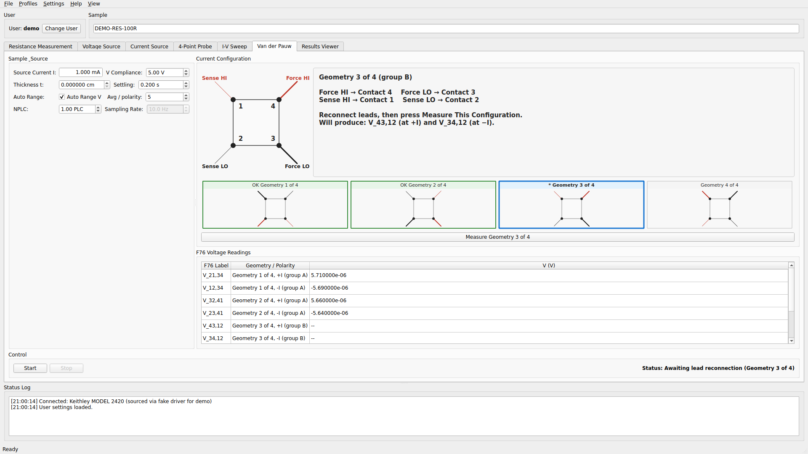

# Quick Start

This walks you through your first measurement and the per-mode workflows. If a term is unfamiliar (NPLC, compliance, Enhanced R, etc.), see [Concepts](concepts.md).

## First measurement

1. **Launch** — `resistamet-gui` (or `resistamet-gui --simulate` for hands-free demo). On Windows with the `.exe`, double-click it.
2. **Pick or create a user profile** in the dialog that appears. Each user has their own settings and data directory.
3. **Test connection** — click the **Test Connection** button on any tab. Either:
    - In simulator mode, it should report a fake Keithley 2400 immediately.
    - With real hardware, it queries `*IDN?` and reports the detected model + firmware. If it fails, see [Troubleshooting](troubleshooting.md#connection-failures).
4. **Enter a sample name** at the top of the window — this names the CSV file written to disk.
5. **Set source level and compliance** on the active tab. Type natural units like `1mA`, `5V`, `100uA`, `0.001` — the spinboxes accept engineering notation directly.
6. **Click Start.** Live readings appear, the plot updates in real time, the bottom strip shows V / I / R / P with their `± σ` uncertainties.

**What success looks like:** The status bar reads `Status: Running`, the live readout has actual numbers (not `--`), and the plot fills in over time. If the readout shows `9.91e37` or stays at `--`, see [Troubleshooting → Compliance hit / 9.91e37](troubleshooting.md#compliance-hit-readings-show-991e37).

## Per-mode workflows

For CSV schemas see [Data Outputs](outputs.md); for parameter explanations see [Concepts](concepts.md).

### Resistance

Source a known current, measure resulting voltage, report R(t). Good for sensors, conductive composites, any DUT where you want resistance over time.

1. Choose **2-wire** or **4-wire** (4-wire eliminates lead resistance — preferred when possible).
2. Set **Test current** and **Voltage compliance** on the tab.
3. (Optional) Short the probes and click **Null Cables** to subtract lead resistance from every subsequent reading.
4. Click **Start**.

**Enhanced accuracy** is on by default (offset-compensated ohms, ~2× slower per reading, cancels thermoelectric EMF).

### Voltage Source

Apply a DC voltage, monitor the resulting current. For chronoamperometry, device biasing, bias-stress experiments.

1. Set **Source voltage**, **Current compliance**, and **Duration** (`0` = run until you click Stop).
2. Click **Start**.

A touch-safety warning fires before any run whose sourced voltage reaches the configured threshold (default 30 V).

### Current Source

Mirror of Voltage Source — apply a DC current, monitor the resulting voltage. Same workflow with the source/measure roles swapped.

### Four-Point Probe

Sheet resistance, resistivity, and conductivity via a collinear 4-point probe. ASTM F84-02 corrections applied automatically when you supply specimen geometry.

1. Set **Source current**, **Probe spacing**, and **Thickness**. Defaults: 100 µA, 0.1016 cm (Signatone SP4).
2. (Optional) Set **specimen diameter**, **w/S**, and **temperature + dopant type** to activate F₂ / F(w/S) / F_T corrections. Leaving these at defaults falls back to classical Smits-1958.
3. Click **Start**. Readings stream into the per-reading table; the live histogram fills in.
4. Click **Save Spot** to archive the current set. Move probe to next position and repeat.
5. Click **Export Summary…** for a per-spot + cross-spot CSV summary.

**Probe power safety**: default soft warn at 10 mW, hard stop at 100 mW (sized for tungsten-carbide SP4 tips). Pre-flight check refuses to start if worst-case `I × V_compliance` exceeds the hard stop.

#### Delta Mode (thermoelectric cancellation)

In the 4PP tab → **Advanced** → check **Current Reversal (Delta Mode)**. Each reading then alternates `+I` / `−I` and reports `V_delta = (V₊ − V₋) / 2`.

#### Auto-select source current (on by default)

By default the 4PP tab picks the source current for you: it probes the sample first and sources the gentlest current that reaches **Target sig figs** (default 4), or tells you why it can't. The manual **Source Current** field is grayed and shows the picked value. Uncheck **Auto-select source current** to set the current by hand. See [Concepts → 4PP current finder](concepts.md#four-point-probe-current-finder).

### Van der Pauw

ASTM F76-08 Method A for sheet resistance and resistivity on arbitrary-shape, hole-free samples with four periphery contacts.



1. Number your four periphery contacts **1–4 counter-clockwise** and connect leads.
2. Enter **sample thickness in µm** (required — you'll be prompted if you leave it blank).
3. Click **Start**. The tab shows a filmstrip of the four geometries. For each one: rewire your leads as shown in the sample diagram, then click **Measure**.
4. After all four geometries, the result panel reports sheet resistance, resistivity, F76 asymmetry, and a homogeneity pass/fail per F76 §11.1.

Output is disabled between geometries so you can safely reconnect leads.

### I-V Sweep

Hardware staircase sweep using the Keithley's trigger model. Source voltage or current with configurable start, stop, step, and per-step delay.

1. Choose **Source mode** (V or I).
2. Set **Start**, **Stop**, **Step**, **Per-step delay**, and **Direction** (`up`, `down`, or `up_down` for hysteresis curves).
3. Click **Start**. The sweep runs on the instrument and the full I-V curve appears at the end.

## Useful inputs

Type natural lab notation instead of raw decimals:

- `1mA` instead of `0.001000 A`
- `100uA` or `100µA` instead of `0.000100 A`
- `10mV` instead of `0.010 V`

The live readout displays in engineering notation: `V: 2.830 mV  I: 1.000 mA  R: 2.830 Ω` with the Wong-palette label color per channel.

Other UI conveniences:

- **Event markers** — press `M` during a run; a dialog asks for a label (default `MARK`) which lands in the CSV's `event` column. The mark-event button on the active tab flashes yellow for 500 ms as visual confirmation.
- **Tab keyboard shortcuts** — `Ctrl/Cmd + 1..6` jumps to tabs 1 through 6 (Resistance → vdP) without clicking
- **Multi-user profiles** — each user gets their own settings via the Settings → User Settings menu
- **Parameter profiles** — Profiles menu → Save / Load Profile for Current Mode writes/reads a JSON of the active tab's measurement-block settings (useful for per-sample-type templates)
- **"Run until stopped"** — set duration to `0` on timed modes for indefinite logging
- **Tab switching during a run** — the active tab keeps logging, inactive tabs are read-only; status bar shows "Viewing X tab (read-only) — Y measurement running"
- **Smoothed live readout** — the text readout updates at 4 Hz from a ~500 ms rolling mean over the last `max(5, round(0.5 × sampling_rate))` samples, so noisy traces stay readable. The plot, CSV, and stats still see every full-rate sample.

## Testing locally

```bash
# Unit + integration suite (sub-second)
QT_QPA_PLATFORM=offscreen pytest tests/ -v

# End-to-end suite (drives every tab through the in-package simulator,
# asserts recorded values against Ohm's law on a known fake DUT)
QT_QPA_PLATFORM=offscreen pytest tests/test_e2e_simulator.py -v

# Unit tests only (no Qt dependency)
pytest tests/ -v --ignore=tests/test_gui_smoke.py --ignore=tests/test_e2e_simulator.py
```

The e2e suite runs in its own pytest invocation because it leaves process-wide state (a `pyvisa.ResourceManager` monkey-patch and a live `QApplication`) that interacts poorly with module-scoped fixtures from earlier test files. CI runs both invocations in sequence.
